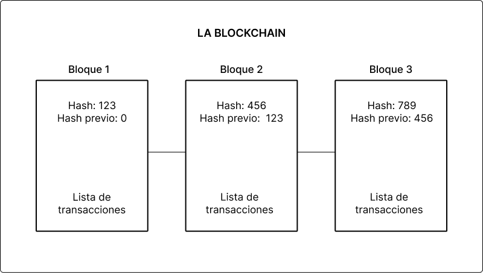
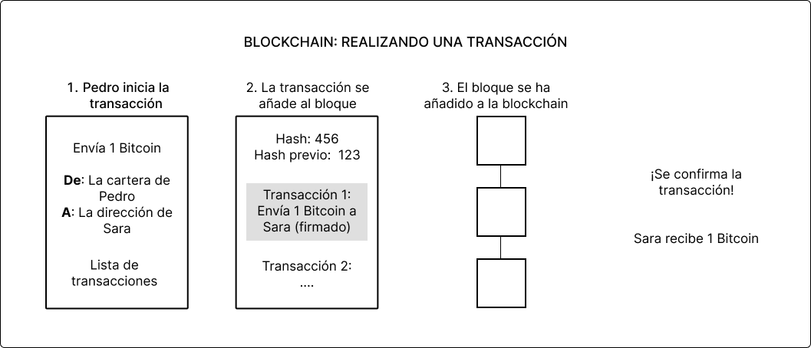
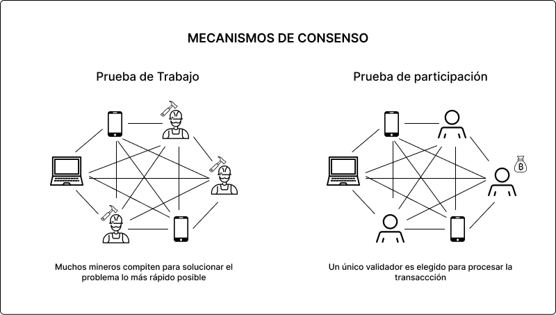

# ¿Qué es la tecnología Blockchain?
# 

## ⛓️ La Cadena de Bloques
Como su nombre en inglés indica, una “blockchain” es una cadena de bloques que contiene información.

Esta técnica fue creada originalmente en 1991 por un grupo de investigadores y se utilizó para sellar el tiempo de los documentos digitales, de modo que estos documentos sean inmutables y no se puedan manipular. Para que nos entendamos, una blockchain es un libro de contabilidad distribuido que está completamente abierto a cualquiera pero cuyas entradas no se pueden manipular.

Resumiendo, las cadenas de bloques tienen 3 particularidades que las definen:

* **Descentralizadas**: Las transacciones están en una red de ordenadores (nodos).
* **Inmutables**: Las transacciones no pueden modificarse una vez confirmadas.
* **Abiertas**: Las transacciones pueden ser vistas por cualquiera.

Por ejemplo, la blockchain de Bitcoin almacena los detalles de una transacción: **el remitente, el receptor y la cantidad de monedas**.

## 🔩 Cómo funcionan las Blockchain

### Contenidos de la Blockchain

Cada bloque tiene:

* **Una lista de transacciones**.
* **Un hash** (una huella digital compuesta por una larga cadena de caracteres aleatorios) para el bloque.
* **El hash del bloque anterior** (así es como se vinculan los bloques).

# 

### Transacciones
Veamos cómo funciona una transacción en la cadena de bloques:

Supongamos que Pedro quiere enviar a Sara 1 bitcoin.

En primer lugar, tanto Pedro como Sara necesitan carteras de criptomonedas. Estos monederos no almacenan realmente esos activos. En su lugar, almacenan dos claves:

* Clave pública: Una clave pública está vinculada a una dirección que te permite enviar y recibir transacciones. Piensa en ella como en tu dirección de correo electrónico.
* Clave privada: Una clave privada demuestra que usted es dueño de los tokens asociados a su dirección pública. Piensa en ella como en su contraseña de correo electrónico. Dado que una clave privada es difícil de recordar (es una larga cadena de números aleatorios), los monederos también te dan una frase semilla de 12 a 24 palabras. No deberías compartir tu clave privada ni tu frase semilla con nadie.

Pedro puede enviar a Sara 1 bitcoin siguiendo estos tres pasos:

# 

1. Pedro le dice a su monedero: “Quiero enviar 1 bitcoin desde mi dirección pública a la dirección pública de Sara”. Pedro firma esta transacción basándose en su clave privada. Esta firma demuestra que Pedro posee realmente 1 bitcoin.
2. El monedero de Pedro envía la transacción a los nodos de la cadena de bloques. Estos nodos verifican la transacción utilizando la firma y la clave pública de Pedro.
3. Un nodo agrupa la transacción de Pedro con otras transacciones en un bloque. A continuación, trabaja con otros nodos para añadir el bloque a la cadena de bloques.

Sara verá 1 bitcoin en su monedero sólo cuando se hayan completado los tres pasos.

Un bloque sólo puede añadirse a la cadena de bloques si otros nodos están de acuerdo. Veamos cómo los nodos alcanzan el consenso.

## Mecanismos de consenso

Para procesar las transacciones sin intermediarios, los nodos deben ser capaces de llegar a un consenso por sí mismos. Lo hacen a través de dos métodos populares:

# 

### Prueba de trabajo (Proof of Work)

1. Los nodos conocidos como mineros compiten para resolver un problema matemático utilizando la fuerza bruta (por ejemplo, lanzando un dado miles de veces para obtener el número correcto).
2. El primer minero que resuelve el problema crea un bloque.
3. Otros nodos comprueban si el bloque es válido. Si lo es, el minero recibe una recompensa en forma de criptomoneda. Si no lo es, el minero pierde su tiempo y energía.
4. Todos los nodos añaden el nuevo bloque a su copia de la cadena de bloques.

La prueba de trabajo utiliza energía porque los mineros compiten para resolver problemas matemáticos construyendo potentes máquinas que funcionan las 24 horas del día.

### Prueba de participación (Proof of Stake)

1. Los nodos, conocidos como validadores, ponen en juego alguna criptomoneda. Una apuesta es como decir: “Voy a comprometer esta cantidad de criptodivisa para ganar el derecho a hacer esta transacción”.
2. Los validadores con más apuestas tienen más probabilidades (pero no están garantizadas) de ser seleccionados para procesar la transacción y crear un bloque.
3. Otros validadores comprueban si el bloque es válido. Si lo es, todos los validadores participantes ganan una comisión por la transacción. Si no lo es, el validador que creó el bloque puede perder su participación.
4. Todos los nodos añaden el nuevo bloque a su copia de la cadena de bloques.

La prueba de participación utiliza menos energía que la prueba de trabajo. Bitcoin utiliza la prueba de trabajo, y Ethereum está pasando actualmente de la prueba de trabajo a la prueba de participación.

## El trilema de la cadena de bloques

Las cadenas de bloques suelen bucar un equilibrio entre seguridad, descentralización y escalabilidad:

* Seguridad: Capacidad para defenderse de errores y ataques.
* Descentralización: Capacidad de soportar muchos nodos.
* Escalabilidad: Capacidad de soportar un gran volumen de transacciones.

Por ejemplo, consideremos las cadenas de bloques Ethereum y Solana. En diciembre de 2021:

* El coste medio de las transacciones de Solana era de 0,00025 dólares con 1.000 nodos validadores.
* El coste medio de las transacciones de Ethereum era de 5,2 dólares con más de 10.000 nodos validadores.

Cuantos más nodos haya, menos probable es que una cadena se vea comprometida. Este artículo no trata sobre qué cadena es mejor, sólo recuerda que esta compensación existe.
