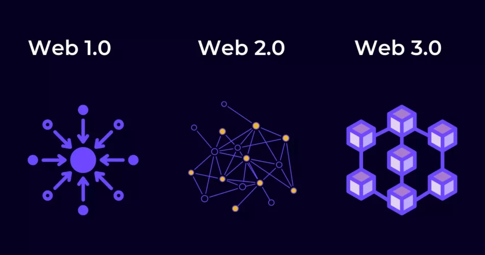

# ¿Qué es la Web 3.0?

## Introducción

En este artículo, vamos a explicar qué es la Web3 (o Web 3.0) y cómo las ideas provenientes del mundo de las criptomonedas están relacionadas con la evolución del internet actual y lo que esto significa para ti como usuario.

Antes de empezar quiero aclarar que a día de hoy, no existe ningún ente oficial que defina de forma estricta lo que es la Web3.

Así que en su lugar voy a dar una definición aproximada de lo que se entiende que es la Web 1.0, lo que mucha gente dice que es la Web 2.0 y luego explicaré este nuevo fenómeno que mucha gente está llamando Web 3.0.

## La Web 1.0, los inicios

Empecemos con la Web 1.0 como una visión inicial de cómo era Internet entre los años 1991 y 2004. Internet era en su mayoría un montón de páginas estáticas, lo que significa que cada vez que las cargabas sólo mostraban algunas cosas y eso era todo. Algunos lo llamaban "sólo lectura”, ya que no se podía iniciar sesión ni interactuar con los mensajes o ver los análisis.

La mayor parte de la primera Internet ni siquiera era rentable por la falta de publicidad. Era, para que nos entendamos, como una gran Wikipedia con todo su texto e hipervínculos. Con el tiempo se fueron haciendo mejoras y cosas como [Flash](https://es.wikipedia.org/wiki/Adobe_Flash) y [JavaScript](https://es.wikipedia.org/wiki/JavaScript) añadieron muchas nuevas características diferentes. Sin embargo, durante este tiempo, los usuarios de Internet eran consumidores. Iban a Internet para consumir información.

## Web 2.0, interactividad centralizada

A continuación, tenemos la Web 2.0, que se formó alrededor de 2004 y es el internet que conocemos ahora mismo. Durante este tiempo, la web evolucionó mucho, pero uno de los mayores cambios fue la interactividad, lo que significó que no sólo obtenemos información de las páginas, sino que las páginas web empezaron a obtener información de nosotros.

A medida que vemos Facebook y Youtube y realizamos búsquedas en Google, estas empresas centralizadas recopilan datos sobre nosotros para poder ofrecernos mejores contenidos que, a su vez, nos hacen permanecer más tiempo en sus sitios web o aplicaciones.

Esto se traduce en más dinero para estas empresas, pero esto no se acaba aquí, han llevado su negocio aún más allá: estas empresas empaquetan todos los datos que han recogido sobre nosotros y los venden a los anunciantes.

La Web 2.0 representa la era de la publicidad dirigida y la falta de privacidad para sus usuarios.  También es cierto que, para ser justos, los usuarios hemos renunciado voluntariamente a esta privacidad a cambio de entretenimiento y una buena experiencia de usuario.

En la Web 2.0 cada usuario recibe contenido personalizado. Por ejemplo, dos usuarios verán diferentes feeds en Instagram.

El contenido que ves en tu feed viene de los datos que clasifica la empresa basándose en información proporcionada por ti mismo, como son los likes o los videos que has visto.

Pero si observas los anuncios que te ofrecen aplicaciones como Facebook o Instagram, están basados en el conocimiento que tienen sobre ti y del que no eras ni tan solo consciente de haberles dado. Saben donde fuiste a cenar ayer, a que hora dejas a tus hijos en el colegio,etc.

Incluso hace un tiempo se publicó un artículo en el que explicaban que gracias a la técnica de "[machine learning](https://es.wikipedia.org/wiki/Aprendizaje_autom%C3%A1tico)” Facebook empezó a sugerirle a un hombre anuncios relacionados con la paternidad, porque de alguna manera sabían que iba a ser padre antes incluso de que él lo supiera.

Sin saber exactamente las causas por las que de golpe le aparecieron esos anuncios, bien podría haber sido debido a que su pareja había realizado búsquedas relacionadas con los síntomas del embarazo y al hacerlo bajo la misma direccion IP (direccion de internet), el algoritmo de "machine learning” probablemente ya sabía que estaba embarazada.

## La Web 3.0, descentralización y realidad virtual

La Web 3.0 (o Web3) es la próxima evolución de Internet, que, entre otras tecnologías como la realidad virtual y la realidad aumentada, haga uso de la tecnología blockchain y las herramientas de descentralización. En la Web 2.0, tú eras el producto mientras navegabas por las redes sociales, pero en la Web 3.0, se cree que ahora serás el dueño de tu contenido y de las cosas que publiques en línea.

Si quieres que un post en una red social permanezca online, permanecerá online, pero si quieres quitarlo, en la Web3 puedes controlarlo, porque como todos sabemos, hoy en dia cuando algo se sube a internet, se queda de forma permanente.

He aquí un ejemplo que ya es real: [Odysee](https://odysee.com/) es una alternativa blockchain a Youtube donde se pueden publicar vídeos y los creadores pueden ganar tokens que son básicamente una recompensa por atraer a los espectadores a ver sus vídeos.

Lo que ocurre con Odysee es que no pueden impedir que se publique un vídeo, si alguien lo sube y alguien más en la red quiere compartirlo, técnicamente descargan ese vídeo y luego permiten que otros lo vean y si quieren también lo pueden descargar.

Funciona como una [red de torrents](https://es.wikipedia.org/wiki/BitTorrent), es decir, haciendo un paralelismo con Facebook, tu publicación no podría ser retirada porque tu publicación no estaría sólo en uno de los servidores de Facebook, estaría teóricamente en miles de ordenadores de todo el mundo asegurando que la red social de blockchain en la que estás no es atacada o censurada.

Teóricamente esto significa que nos encontraríamos también con muchos contenidos ilegales y falsos publicados pero eso sería en nombre de la libertad. Los usuarios de las redes probablemente podrían implementar un sistema para reducir ese contenido dañino.

Pero esto ya lo explicaremos en otro artículo 🙂.

Los expertos dicen que llegaremos a un punto en Internet en el que todas las empresas estarán dirigidas por un grupo descentralizado, conocido como DAO, que proviene del inglés y significa "organización autónoma descentralizada”. Esto significa que no hay directores generales ni presidentes. Aquellos que tengan la mayor cantidad de tokens (monedas) podrán votar sobre cómo cambia la empresa, sin estar limitados por un gobierno o una tradición familiar.

De hecho, hace un tiempo, una DAO quiso comprar a un equipo de fútbol español, concretamente al [Cadiz](https://www.diariodecadiz.es/cadizcf/compra-cadiz-cf-criptomonedas-magicoDAO-acciones-futbol_0_1648635330.html).

En la Web 3.0 no habrá censura en redes sociales como Facebook, Twitter, Instagram o TikTok. Una autoridad gubernamental tendría muy complicado cerrarla. Además, una de las cosas más importantes de la Web 3.0 es que tu identidad digital no está conectada al 100% con tu identidad en el mundo real. Esto significa que puedes navegar páginas, descargar archivos, hacer compras y hacer cualquier otra actividad en Internet sin que te rastreen.

## Conclusión
Aunque está todo por definir y la tecnología blockchain es solo un actor más en esta revolución, parece que todo apunta hacia el camino de la descentralización.

No va a ser un montón de cosas que cambien nuestras vidas de una sola vez, probablemente será una serie de ideas que crecerán juntas, como la realidad virtual, la aumentada, el metaverso, etc,  hasta que las empresas centralizadas como Facebook y Google sean reemplazadas por DAOs descentralizadas y no reguladas.

De momento, este mundo está aún "en pañales”. No existe un consorcio que agrupa a distintas empresas (la Web3 Foundation por ejemplo se focaliza en un proyecto concreto, Polkadot). Pero espero que esto poco a poco vaya cambiando.

La web 3.0 es un gran concepto que es un montón de pequeñas ideas, no una idea dirigida por una fundación para que te ilusiones con el siguiente paso de internet o para que compres su criptomoneda.
