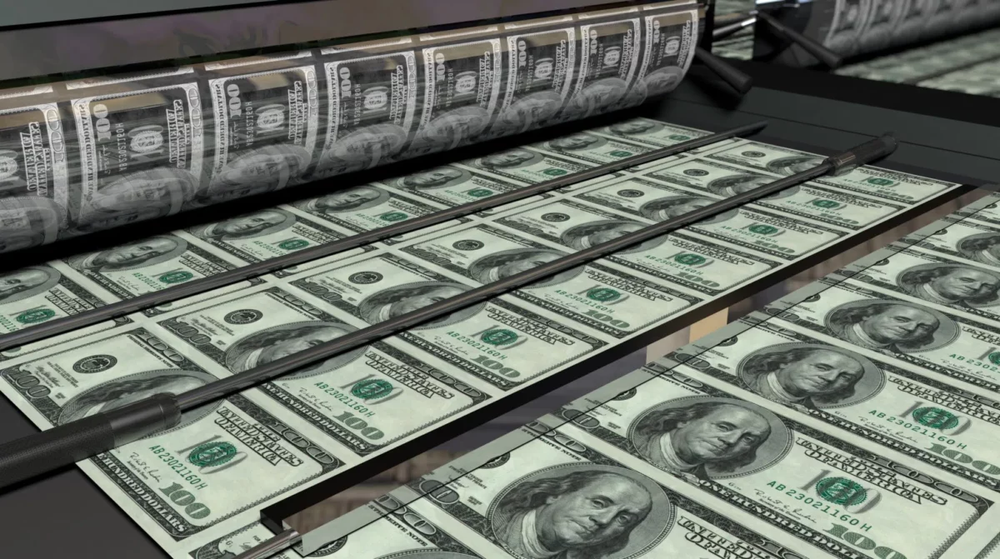
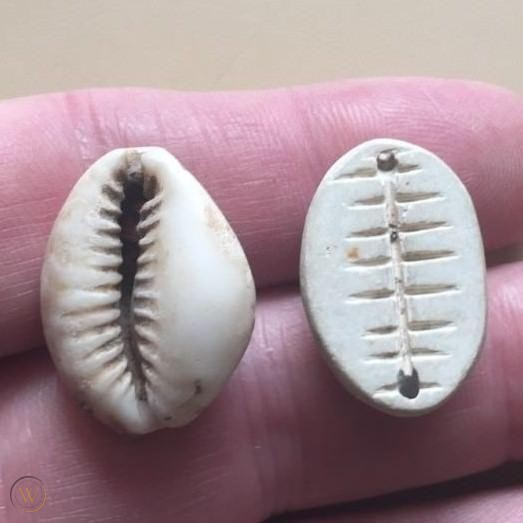

# ¿Qué es el dinero?

## ¿Qué es el dinero y como funciona?

“¿Qué es el dinero y como funciona?” Esta es una pregunta que he pasado gran parte de mi vida haciéndome. Lo curioso es que, en general, cuando le he preguntado esto a mis padres, familiares y amigos, mayoritariamente no han conseguido explicarme de qué va esto del dinero.

Vamos por pasos. Lo primero es entender que en esencia, **el dinero representa valor**.

Si yo hago un trabajo para ti, tú me das dinero a cambio del valor que te he dado. Después puedo utilizar ese dinero para obtener algo de valor de otra persona en el futuro.

A lo largo de la historia, el valor ha adoptado muchas formas y la gente ha utilizado muchos materiales diferentes para representar el dinero.La sal, el trigo, las conchas y, por supuesto, el oro se han utilizado como medio de intercambio.Sin embargo, para que algo represente un valor, la gente tiene que confiar en que es realmente valioso y que seguirá siéndolo el suficiente tiempo como para poder canjearlo en el futuro.

Hasta hace unos cien años siempre confiábamos en que algo físico representaba nuestro dinero. Pero algo sucedió en el camino y hemos pasado de confiar en “una cosa” a confiar en alguien.

Me explico:

## El papel moneda

Con el tiempo, a la gente le resultó demasiado engorroso andar por el mundo llevando lingotes de oro u otras formas de dinero, así que se inventó el papel moneda.

Así es como funcionaba:

a) Un banco o gobierno ofrecía tomar posesión de tu lingote de oro, digamos que con un valor de 1000 Euros. A cambio, ese banco te daría certificados de recibo, que llamamos billetes, por un valor de 1000 Euros.
b) Estos trozos de papel no sólo eran mucho más fáciles de llevar, sino que podías gastar un euro en una taza de café y no tenías que cortar tu lingote de oro en mil pedazos.
c) Y si querías recuperar tu oro, simplemente llevabas 1000 euros en billetes al banco para canjearlos por la forma real de dinero, en este caso ese lingote de oro, cuando lo necesitaras…

Y así, el papel comenzó su uso como dinero como instrumento de practicidad y conveniencia.Sin embargo, con el paso del tiempo, y debido a los cambios macroeconómicos, este vínculo entre el recibo de papel y el oro que representa se rompió.

Ahora bien, explicar el camino que nos llevó a alejarnos del [patrón oro](https://economipedia.com/definiciones/patron-oro.html) es extremadamente complejo, pero podemos resumirlo en que los gobiernos dijeron a sus ciudadanos que el propio gobierno sería responsable del valor de ese papel moneda.

## El dinero fiat

De un día para otro, [a un tal Nixon](https://economipedia.com/actual/por-que-estados-unidos-ab), que era un iluminado, se le ocurrió decir: “Olvidémonos del oro y comerciemos con papel”.Así que la gente siguió comerciando con recibos que no están respaldados por nada más que la promesa del gobierno.

¿Y por qué siguió funcionando? Pues por la confianza.

A pesar de que no hay ninguna mercancía que respalde el papel moneda, la gente confiaba en el gobierno y así es cómo se creó el dinero fiduciario.

Fiat es una palabra latina que significa “*por decreto*”.

Eso quiere decir que los dólares, o los euros, o cualquier otra moneda, tienen valor porque el gobierno lo ordena. Es lo que se conoce como “*moneda de curso legal*”: monedas o billetes que deben ser aceptados si se ofrecen como pago.

El valor del dinero actual proviene de un estatus legal que le otorga una autoridad central, en este caso, el gobierno. Así que el modelo de confianza ha cambiado, pasando de confiar en algo a confiar en alguien, como no, en el gobierno.

## Los inconvenientes del dinero Fiat

El dinero fíat tiene dos inconvenientes principales:

1. **Está centralizado**: Tiene una autoridad central que lo controla y emite. En este caso el gobierno o el banco central.
2. **No está limitado por la cantidad**: El gobierno, a través del banco central puede imprimir todo lo que quiera cuando lo necesite e inflar la oferta de dinero en el mercado.

El problema de imprimir dinero es que, al inundar el mercado con más dinero, el valor de cada euro o dolar baja, por lo que **el propio dinero vale menos**.

Cuando ves que los precios suben a lo largo de los años, no es necesariamente que los precios estén subiendo, **sino que el poder adquisitivo de tu dinero está cayendo**. Se necesitan más euros para comprar algo que antes “costaba menos”.

Una vez que el dinero fiduciario se puso en marcha, dar paso al dinero digital era bastante sencillo. Ya que tenemos una autoridad central que emite dinero (el Banco Central), ¿por qué no hacer que el dinero sea mayoritariamente digital y dejar que esa autoridad lleve la cuenta de lo que posee cada uno de nosotros?.

Hoy utilizamos principalmente **tarjetas de crédito, transferencias bancarias, Paypal** y otras formas de dinero digital. De hecho, la cantidad de dinero físico en el mundo es casi insignificante y se reduce con cada año que pasa.

Entonces, si el dinero hoy es digital, ¿cómo funciona? Es decir, si tengo un archivo que representa un euro, ¿qué me impide copiarlo un millón de veces y tener un millón de dólares?

Esto se conoce como el “problema del doble gasto”.

## El doble gasto y la contabilidad centralizada

El sistema de contabilidad que utilizan los bancos hoy en día es una sistema “*centralizado*“: llevan un libro de contabilidad en su ordenador que lleva la cuenta de lo que posee cada cliente.

Todo el mundo tiene una cuenta y este libro de contabilidad lleva un recuento de cada cuenta. Todos confiamos en el banco y el banco confía en su ordenador, por lo que la solución está centralizada en este libro de contabilidad en este ordenador.

Puede que no lo sepas, pero hubo muchos intentos de crear formas alternativas de monedas digitales, sin embargo ninguna tuvo éxito en resolver el problema del doble gasto sin una autoridad central.

## El poder y el dinero

Siempre que le das a alguien el control sobre el suministro de dinero le estás dando un enorme poder y esto crea tres grandes problemas:

1. El primer problema es la corrupción; el poder corrompe, y el poder absoluto corrompe absolutamente. Cuando los bancos tienen el mandato de crear dinero, o valor, básicamente controlan el flujo de valor en el mundo, lo que les da un poder casi ilimitado.

Un pequeño ejemplo de cómo el poder corrompe puede verse en el escándalo de Wells Fargo, donde los empleados crearon en [secreto millones de cuentas bancarias](https://www.eleconomista.es/banca-finanzas/noticias/8581085/08/17/Wells-Fargo-creo-35-millones-de-cuentas-falsas-entre-2009-y-2016.html) y de tarjetas de crédito no autorizadas para inflar el flujo de ingresos del banco, sin que sus clientes lo supieran durante años.

2. El segundo problema de un sistema centralizado es la mala gestión. Si los intereses de la autoridad central no están alineados con los de las personas que controla, puede darse un caso de mala gestión del dinero.

Por ejemplo, imprimir mucho dinero para salvar a un determinado banco o institución del colapso, como ocurrió en 2008. El problema de imprimir demasiado dinero es que provoca inflación y básicamente erosiona el valor del dinero de los ciudadanos.

Un ejemplo extremo de esto es Venezuela, donde el gobierno ha impreso tanto dinero, y el valor del mismo ha caído tanto, que [la gente ya no cuenta el dinero sino que lo pesa](https://hipertextual.com/2016/11/en-venezuela-el-dinero-vale-tan-poco-que-ya-no-se-cuenta-se-pesa%22).

Básicamente estás cediendo todo el control de tu dinero al gobierno o al banco. En cualquier momento, el gobierno puede decidir congelar su cuenta y negarle el acceso a sus fondos. Un ejemplo de esto fue lo que ocurrió con el famoso [“corralito” Argentino](https://www.eleconomista.es/economia/noticias/11507846/12/21/El-corralito-de-2001-un-salto-al-vacio-que-aun-impacta-en-Argentina.html).

Incluso si sólo utilizas dinero en efectivo, el gobierno puede cancelar el estatus legal de tu moneda, como se hizo en la India hace unos años.

## El Bitcoin como respuesta

## Conclusión

* El dinero representa valor
* La gestión del dinero está centralizada a través de los bancos centrales de cada país
* Antiguamente, cada billete representaba una porción de oro de las reservas de cada país. Lo que se conoce como el “patrón oro”
* En los años 70 se dejó de utilizar y se pasó al actual modelo fiduciario
* El gobierno, a través del banco central puede imprimir todo lo que quiera cuando lo necesite e infla la oferta de dinero en el mercado
* Es lo que se conoce como “inflación”
* Bitcoin es la respuesta al sistema financiero centralizado
