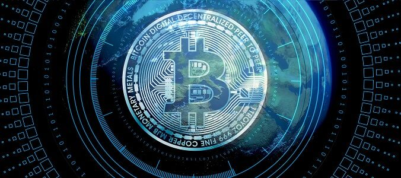
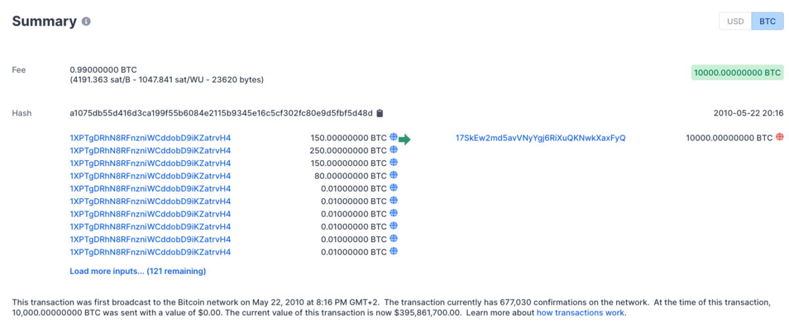
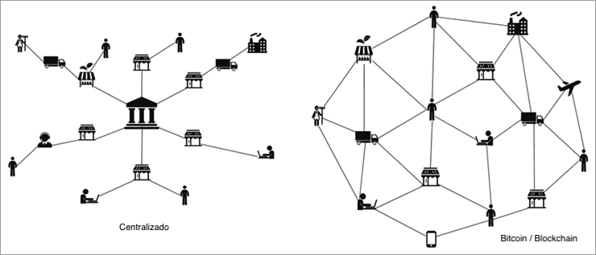

# ¿Qué es el Bitcoin?
# 

## ​Satoshi Nakamoto, el padre del Bitcoin

En octubre de 2008 se publicó en Internet un documento de un tipo que se hacía llamar Satoshi Nakamoto.

El documento, también llamado [“whitepaper”](https://bitcoin.org/files/bitcoin-paper/bitcoin_es_latam.pdf), sugería una forma de crear un sistema para una moneda descentralizada llamada Bitcoin.
Este sistema pretendía crear un dinero digital que resolviera el problema del doble gasto sin necesidad de una autoridad central.

En esencia, Bitcoin es un **libro de contabilidad** transparente sin una autoridad central, pero ¿qué significa realmente este concepto un tanto confuso?

Bueno, comparemos Bitcoin con el banco.

## Bancos vs Bitcoin, Transparencia vs opacidad

Dado que la mayor parte del dinero hoy en día ya es digital, el banco básicamente gestiona su propio libro de cuentas y transacciones.

Sin embargo, el libro de contabilidad del banco **no es transparente** y se almacena en el ordenador principal del banco. No se puede echar un vistazo al libro de contabilidad del banco, y sólo el banco tiene un control total sobre él.

En cambio, Bitcoin es un libro de contabilidad **transparente**. En cualquier momento puedo echar un vistazo al libro de contabilidad y ver todas las transacciones y los saldos que están teniendo lugar.

Lo único que no se puede saber fácilmente es a quién pertenecen estos saldos y quién está detrás de cada transacción. Esto significa que Bitcoin es pseudo-anónimo; es decir que todo es abierto, transparente y rastreable, pero no se puede saber quién envía qué a quién.

Vamos a explicar esto con un ejemplo:

## El día de la pizza

# 
Enlace a la transacción : https://bit.ly/3OGU1hj

En esta imágen puedes ver la transacción realizada por una determinada dirección de Bitcoin envió 10.000 Bitcoins a otra dirección de Bitcoin en mayo de 2010. Esta transacción específica es la primera compra que se hizo con Bitcoin y fue utilizada para comprar 2 pizzas por un tipo llamado Laszlo.

Laszlo publicó un post en 2010 pidiendo que alguien le vendiera 2 pizzas a cambio de 10.000 Bitcoins. Pues bien, alguien lo hizo, y ahora el precio de estas dos pizzas vale hoy más de [300 millones de Euros](https://es.exchangerate.guru/btc/eur/10000/).

## Bitcoin es descentralizado

Bitcoin también está descentralizado; no hay un ordenador que tenga el libro de contabilidad. Pero ¿qué significa realmente este concepto un tanto confuso?

Con Bitcoin, cada ordenador que participa en el sistema también guarda una copia del libro de contabilidad, también conocido como Blockchain.

Por lo tanto, si se quiere derribar el sistema o hackear el libro de contabilidad, habrá que derribar miles de ordenadores que mantienen una copia y la actualizan constantemente.

# 

Como la mayoría del dinero actual, Bitcoin también es digital. Esto significa que no hay nada físico que puedas tocar en Bitcoin. No hay monedas reales, sólo hay filas de transacciones y saldos.

Cuando uno es “dueño” de Bitcoin significa que posee el derecho de acceder a un registro de dirección de Bitcoin específico en el libro mayor y enviar fondos desde él a una dirección diferente.

## ¿Por qué Bitcoin es una innovación tan importante?

Bueno, por primera vez desde que existe el dinero digital, tenemos una alternativa al sistema actual. Bitcoin es una forma de dinero que ningún gobierno o banco puede controlar.

Si pensamos en la época anterior a Internet, en lo centralizado que estaba el flujo de información. Básicamente si querías información podías obtenerla de unos pocos periódicos.

Hoy en día, gracias a Internet, la información está descentralizada y puedes comunicar y consumir conocimientos de todo el mundo con sólo pulsar un botón.

Bitcoin es el Internet del dinero y ofrece una solución descentralizada para el dinero. Además, Bitcoin presenta varias ventajas sobre el sistema actual:

* En primer lugar, te ofrece un control total sobre tu dinero.
* Con Bitcoin, tú y sólo tú puedes acceder a tus fondos.
* Ningún gobierno o banco puede decidir congelar tu cuenta o confiscar tus posesiones., pero ¿qué significa realmente este concepto un tanto confuso?
* Bitcoin también elimina muchos intermediarios del proceso de transferencia de dinero.
* Esto significa que en muchos casos el uso de Bitcoin es más barato que las transferencias tradicionales o las remesas a través de MoneyGram o Western Union.
* Además, a diferencia de las monedas fiduciarias (explicadas en este artículo), Bitcoin fue diseñado para ser digital por naturaleza, lo que significa que se pueden añadir capas adicionales de programación sobre él y convertirlo en “dinero inteligente”, pero se hablará de ello en vídeos posteriores.
* Por último, Bitcoin abre el comercio digital a 2.500 millones de personas en todo el mundo que no tienen acceso al sistema bancario actual. Un ejemplo de esto sería la adopción de Bitcoin por parte de El Salvador.

Hoy en día, con un teléfono móvil y un clic en un botón puedes empezar a operar con Bitcoin, sin necesidad de permiso. Cada vez hay más comercios online y offline que aceptan Bitcoin. Se puede pedir un vuelo o reservar un hotel con Bitcoin si lo deseas.
Incluso hay tarjetas de débito Bitcoin que le permiten pagar en casi cualquier tienda con su saldo Bitcoin.

Sin embargo, el camino hacia la aceptación por parte de la mayoría del público es todavía largo. La revolución del dinero comenzó en 2009 y estos días estamos viendo cómo cambia el dinero tal y como lo conocemos a día de hoy.

## Conclusión
* Los libros de contabilidad de los bancos son centralizados (todos los datos de sus clientes se almacenan en un único ordenador
* Bitcoin es un libro de contabilidad transparente sin una autoridad central (descentralizado)
* El dinero que almacenas en un banco puede ser confiscado en cualquier momento
* Con Bitcoin solo tú puedes acceder a tus fondos (si los almacenas correctamente). Ningún banco o gobierno los podrán controlar
* Bitcoin se está convertiendo lentamente en una alternativa al dinero convencional
