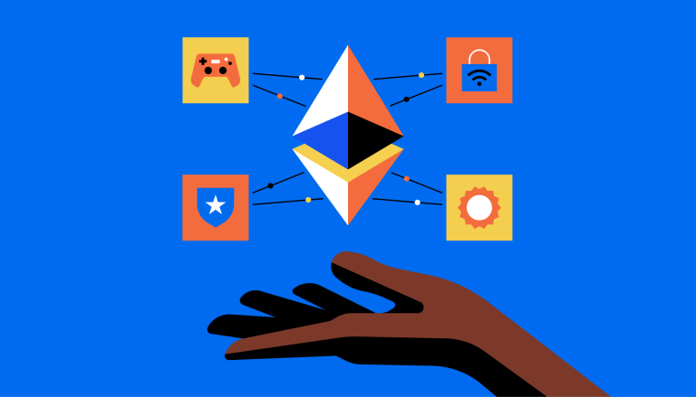

# ¿Qué es el Ethereum?

## ¿Qué es Ethereum?

Seguro que has oído hablar de este proyecto. A día de hoy, Ethereum es la segunda criptomoneda más grande que existe, pero ¿a qué es debida su popularidad?.

¿Es un proyecto tan revolucionario como Bitcoin? ¿Puede realmente cambiar el mundo tal y como lo conocemos?

Antes de entrar en definir que es Ethereum te recomiendo que leas [esta guía que explica lo que es Bitcoin](../bitcoin/que-es-bitcoin.md), ya que es la base sobre la que nació Ethereum.

Después de repasar el artículo sobre Bitcoin, probablemente ya tengas claro que es una forma de dinero descentralizado. Antes de que se inventara Bitcoin, la única forma de utilizar el dinero digitalmente era a través de un intermediario como un banco, o Paypal.
Incluso entonces, el dinero utilizado seguía siendo una moneda emitida y controlada por el gobierno.

Sin embargo, Bitcoin cambió todo eso al crear una forma descentralizada de moneda con la que los individuos podían comerciar directamente sin necesidad de un intermediario.
Cada transacción de Bitcoin es validada y confirmada por toda la red de Bitcoin.
No hay ningún punto de fallo, por lo que el sistema es prácticamente imposible de cerrar, manipular o controlar.

## Dinero descentralizado, ¿y qué más?

Bien, ahora que sabemos que el dinero puede ser descentralizado, ¿qué otras funciones de la sociedad que hoy están centralizadas estarían mejor servidas en un sistema descentralizado?

### Descentralización para todos

La votación requiere una autoridad central para contar y validar los votos.
Los registros de transferencia de bienes inmuebles utilizan actualmente autoridades de registro de la propiedad centralizadas.
Las redes sociales como Facebook se basan en servidores centralizados que controlan todos los datos que cargamos en ellas.

¿Y si pudiéramos utilizar la tecnología que hay detrás de Bitcoin, más conocida como Blockchain, para descentralizar también otras cosas?

Lo interesante de la tecnología Blockchain es que en realidad es el subproducto de la invención de Bitcoin.
La tecnología Blockchain se creó fusionando tecnologías ya existentes como la criptografía, la prueba de trabajo y la arquitectura de red descentralizada para crear un sistema que pueda tomar decisiones sin una autoridad central.

No existía la “tecnología blockchain” antes de que se inventara Bitcoin. Blockchain es a Bitcoin lo que Internet es al correo electrónico; un sistema sobre el que se pueden construir aplicaciones y programas.
Así que esto entusiasmó a la gente, y empezaron a explorar qué más podemos descentralizar.

Sin embargo, para que un sistema sea realmente descentralizado necesita una gran red de ordenadores que lo haga funcionar. En aquel entonces, la única red que existía era Bitcoin y era bastante limitada.

Bitcoin está escrito en lo que se conoce como un lenguaje “incompleto de Turing” que hace que sólo entienda un pequeño conjunto de órdenes, como por ejemplo, quién ha enviado cuánto dinero a quién.
Si quieres crear un sistema más complejo, necesitarás un lenguaje de programación diferente, lo que significa una red de ordenadores diferente.

Imagina por un segundo que quieres construir tu propio programa descentralizado, como Bitcoin, en casa.
Necesitarías entender cómo funciona la descentralización de Bitcoin, escribir un código que imite el mismo comportamiento, conseguir una enorme red de ordenadores para ejecutar este código y así sucesivamente….

Y eso es mucho trabajo.

## Entra en escena Ethereum

Ethereum se propuso por primera vez a finales de 2013 y luego cobró vida en 2014 de la mano de Vitalik Buterin, que por aquel entonces era el cofundador de la revista [Bitcoin Magazine](https://bitcoinmagazine.com/).

Ethereum es la plataforma “hazlo tu mismo” (en inglés do it yourself) para programas descentralizados también conocidos como Dapps – del inglés “Decentralized applications” o lo que es lo mismo, aplicaciones descentralizadas.
Si quieres crear un programa descentralizado que ninguna persona controla, ni siquiera tú aunque lo hayas escrito, todo lo que tienes que hacer es aprender el lenguaje de programación de Ethereum llamado Solidity y empezar a escribir código.

La plataforma Ethereum tiene miles de ordenadores independientes que la ejecutan, lo que significa que está totalmente descentralizada. Una vez que un programa se despliega en la red Ethereum, estos ordenadores, también conocidos como nodos, se aseguran de que se ejecute tal y como está escrito.

Para entendernos, Ethereum es la infraestructura para ejecutar aplicaciones descentralizadas en todo el mundo, no es una moneda, es una plataforma. La moneda que se utiliza para incentivar la red se llama Ether, pero más adelante hablaremos de ello.
El objetivo de Ethereum es el de verdaderamente descentralizar Internet.

## Por un internet verdaderamente descentralizado

Muchos creen que Internet ya estaba descentralizado y que cualquiera podía crear su propia página web, perfil, etc. Aunque en teoría eso podría ser cierto, en la práctica Amazon, Google, Facebook, Netflix y otros gigantes controlan la mayor parte de la red mundial tal y como la conocemos.

Prácticamente no hay actividad en la web que ocurra sin algún tipo de intermediario o tercera parte. Todo esto lo explico en detalle en el artículo sobre la Web 3.0.

Pero una vez que el concepto de descentralización digital fue demostrado por Bitcoin, apareció toda una nueva gama de posibilidades.

* Por fin podemos empezar a imaginar y diseñar una Internet que conecte a los usuarios directamente sin necesidad de una tercera parte centralizada.
* La gente puede comprar criptodivisas directamente entre sí sin necesidad de un intercambio que pueda ser hackeado o robar su dinero.
* La gente puede “alquilar” espacio en el disco duro directamente a otras personas y hacer que Dropbox quede obsoleto.
* Los conductores pueden ofrecer sus servicios directamente a los pasajeros y eliminar a “Uber” como intermediario.

Ethereum permite que las personas se conecten directamente entre sí sin una autoridad central que se encargue de todo. Es una red de ordenadores que se combinan en un potente superordenador descentralizado.

## Los contratos inteligentes

Bien, ahora ya sabes lo que hace Ethereum pero no hemos tocado el tema de cómo lo hace.

El lenguaje de programación de Ethereum, Solidity, se utiliza para crear contratos inteligentes (“smart contracts” en inglés) que son la lógica que ejecuta Dapps.

En la vida real, un contrato es un conjunto de condiciones y acciones. Por ejemplo, si pago a mi casero 900 euros el día 1 del mes, entonces me permite vivir en el piso que me alquila.

Así es exactamente como funcionan los contratos inteligentes en Ethereum. Los desarrolladores de Ethereum escriben las condiciones de su aplicacion descentralizada o Dapp y luego la red Ethereum lo ejecuta.

Se llaman contratos inteligentes porque se ocupan de todos los aspectos del contrato: ejecución, gestión, rendimiento y pago.

Por ejemplo, si tengo un contrato inteligente que se utiliza para pagar el alquiler, el propietario no necesita cobrar activamente el dinero.

* El propio contrato “sabe” si el dinero ha sido enviado.
* Si efectivamente envío el dinero, entonces podré abrir la puerta de mi piso.
* Si no lo hago, se me cerrará la puerta.

Sin embargo, los contratos inteligentes también tienen sus inconvenientes. Volviendo a mi ejemplo anterior, en lugar de tener que echar a un inquilino que no paga, un contrato “inteligente” bloquearía al inquilino que no paga el alquiler..

Un contrato verdaderamente inteligente, por otro lado, tendría en cuenta otros factores, como las circunstancias atenuantes, el espíritu con el que se escribió el contrato y también sería capaz de hacer excepciones si se justifican.

En otras palabras, actuaría como un buen juez. En cambio, un “contrato inteligente” en el contexto de Ethereum no es inteligente en absoluto. En realidad, es intransigentemente estricto con las letras.

Sigue las reglas al pie de la letra y no puede tener en cuenta consideraciones secundarias o el “espíritu” de la ley, como suele ocurrir con los contratos del mundo real.

Una vez que un contrato inteligente se despliega en la red Ethereum, no puede ser editado o corregido, ni siquiera por su autor original. Es inmutable. La única manera de cambiar este contrato sería convencer a toda la red Ethereum de que se debe hacer un cambio y eso es prácticamente imposible.

Esto crea un problema muy serio ya que, a diferencia de Bitcoin, Ethereum fue construido con la capacidad de crear contratos realmente complejos, y los contratos complejos son muy difíciles de asegurar.

Con cualquier contrato, cuanto más complicado es, más difícil es de hacer cumplir ya que se deja más espacio para las interpretaciones, o hay que escribir más cláusulas para hacer frente a las contingencias.

Con los contratos inteligentes, la seguridad significa manejar con perfecta precisión todas las formas posibles de ejecución de un contrato para asegurarse de que el contrato hace sólo lo que el autor pretendía.

## El código es la ley, o no

Ethereum se lanzó con la idea de que “el código es la ley”. Es decir, un contrato en Ethereum es la máxima autoridad y nadie podía anular el contrato.

Pues bien, todo eso se vino abajo cuando se produjo lo que hoy en día se conoce como el ataque a “The DAO”.

Una DAO es una **Organización Autónoma Descentralizada**. Su objetivo es codificar las reglas y el aparato de toma de decisiones de una organización, eliminando la necesidad de documentos y personas en el gobierno, creando una estructura con control descentralizado.

Una empresa alemana decidió crear una DAO que se llamó “*The DAO*”. Recaudó 150 millones de dólares en la moneda Ethereum, ether, cuando el ether cotizaba alrededor de 20 dólares.

Aunque todo esto sonaba muy bien, el código no estaba muy bien asegurado y dio lugar a que alguien descubriera una forma de vaciar el DAO de dinero. Se podría decir que la persona que vació el DAO era un “hacker”. Pero algunos argumentarían que se trataba simplemente de alguien que estaba aprovechando las lagunas que encontró en el contrato inteligente del DAO.

Esto no es muy diferente a un abogado espabilado que descubre una laguna en la ley para lograr un resultado positivo para su cliente. Lo que ocurrió después es que la comunidad de Ethereum decidió que el código ya no es ley y cambió las reglas de Ethereum para revertir todo el dinero que entró en el DAO.

En otras palabras, los redactores del contrato y los inversores hicieron algo estúpido y los desarrolladores de Ethereum decidieron sacarlos de apuros.

La pequeña minoría que no estaba de acuerdo con este movimiento se aferró a la Blockchain original de Ethereum antes de que su protocolo fuera alterado y así nació Ethereum Classic, que es en realidad el Ethereum original.

Hemos cubierto mucho hasta ahora y lo último de lo que quiero hablar es de Ethereum como moneda.

## Ethereum como moneda

Ya hemos establecido que Ethereum es básicamente una red de ordenadores que trabajan juntos como un súper ordenador para ejecutar el código que alimenta las Dapps.

Sin embargo, esto cuesta dinero. Dinero para conseguir las máquinas, aportar electricidad, almacenarlas y enfriarlas si es necesario. Por eso se inventó el Ether.

Cuando la gente habla del precio de Ethereum en realidad se refiere al Ether – la moneda que incentiva a la gente a ejecutar el protocolo de Ethereum en su ordenador.

Esto es muy similar a la forma en que se paga a los mineros de Bitcoin por mantener la cadena de bloques de Bitcoin. Para desplegar un contrato inteligente en la plataforma Ethereum, su autor debe pagar por hacerlo.

Pero esto está a punto de cambiar con Ethereum, ya que va a transicionar de un modelo de prueba de trabajo (con mineros) a uno de prueba de participación (con nodos). [En este artículo](../../blockchain/que-es-blockchain.md) se explican los dos tipos de mecanismos de consenso principales.
